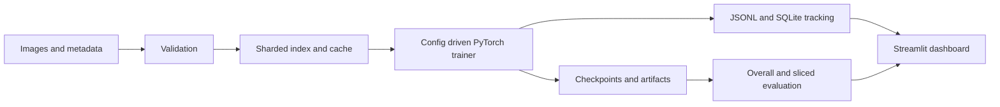

# GeoLGM Trainer

GeoLGM Trainer is a config driven PyTorch training system for image classification with geospatial style metadata. It demonstrates the infrastructure around repeatable model training: validation, indexing, caching, checkpointing, experiment tracking, profiling, evaluation slices, artifact management, and a Streamlit dashboard.

## Why this project exists

Training code is only one part of a reliable ML system. GeoLGM focuses on the operational layer needed to reproduce runs, recover from interruption, inspect artifacts, and compare performance across regions and time buckets.

The included example uses CIFAR-10 images with synthetic location and timestamp metadata around San Francisco. It is a compact demonstration dataset, not a claim of real world geolocation inference.

## Architecture



## Engineering highlights

- Pydantic backed YAML configuration with per run snapshots
- ResNet-18 and compact CNN model options
- ImageNet normalization and pretrained model support
- Resume safe checkpoints and artifact directories
- JSONL metric logs plus SQLite run metadata
- Dataset validation, deterministic indexing, sharding, and parallel preprocessing
- Overall accuracy plus region and time bucket evaluation
- Throughput and resource profiling
- Streamlit experiment dashboard and FastAPI service boundary
- Pytest coverage and GitHub Actions CI

## Quick start

Requirements: Python 3.9 or newer.

```bash
python -m venv .venv
source .venv/bin/activate
pip install -e .
```

Generate the demonstration dataset and prepare it for training:

```bash
python scripts/generate_geocifar.py
geolgm validate-data --data data --out data/validation.json
geolgm build-index --data data --out data/index.csv --shuffle-seed 42
```

Start the configured training run:

```bash
geolgm train --config configs/base.yaml
```

Inspect recent runs or launch the dashboard:

```bash
geolgm query-runs --limit 10
geolgm dashboard --port 8501
```

Resume an interrupted run with the same configuration:

```bash
geolgm train --config configs/base.yaml --resume
```

## Configuration

`configs/base.yaml` defines dataset paths, model selection, training hyperparameters, logging, artifact generation, profiling, and distributed settings. The baseline selects a pretrained ResNet-18, eight epochs, deterministic seed `42`, and a 128-pixel input size.

Each run stores a configuration snapshot, checkpoints, `metrics.jsonl`, plots, and other artifacts under `runs/<run-id>/`; run status and searchable metadata are recorded in `runs.db`.

## Repository structure

```text
configs/       reproducible run configurations
src/geolgm/    data, models, training, tracking, and service code
scripts/       dataset generation, preprocessing, and artifact helpers
dashboards/    Streamlit run explorer
tests/         configuration, validation, database, and artifact tests
.github/       continuous integration workflow
```

## Verification

```bash
pytest
```

GitHub Actions installs the package on Python 3.11 and runs the same test suite for pushes and pull requests.

## Limitations and next steps

- The demonstration metadata is synthetic and should not be interpreted as real geolocation evidence.
- Distributed training flags are represented in configuration, but full multi node orchestration remains future work.
- Production use would require dataset specific governance, monitoring, and infrastructure sizing.
